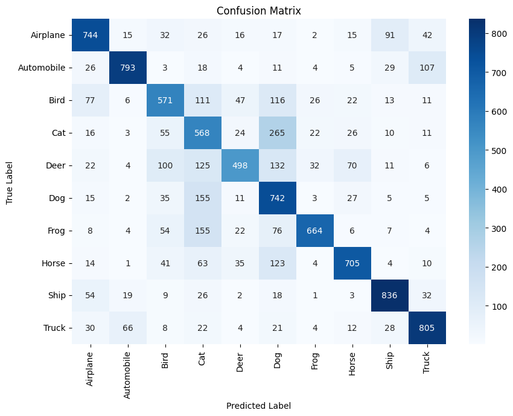
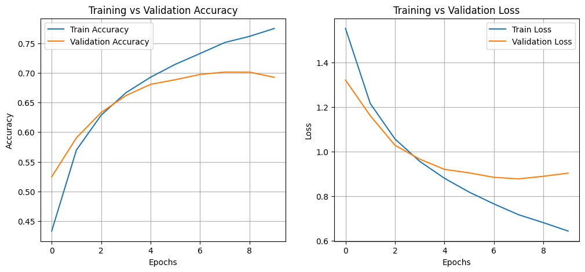

# PROJECT_NAME : CNN Image Classification using TensorFlow
*COMPANY* : CODETECH IT SOLUTIONS  
*NAME* : MAYANK PRATAP SINGH  
*INTERN_ID* : CT04DH1775  
*DOMAIN* : MACHINE LEARNING  
*DURATION* : 4 WEEKS  
*MENTOR* :  Neela Santhosh Kumar  

🖼️ CNN Image Classification using TensorFlow

This project implements a **Convolutional Neural Network (CNN)** to classify images from the **CIFAR-10 dataset** into 10 categories:

`Airplane, Automobile, Bird, Cat, Deer, Dog, Frog, Horse, Ship, Truck`

📌 Project Overview
- **Frameworks Used:** TensorFlow, Keras, Streamlit
- **Model:** Custom 3-layer CNN
- **Dataset:** CIFAR-10 (60,000 32x32 color images, 10 classes)
- **Goal:** Build, train, evaluate, and deploy a CNN image classifier

📊 Model Performance:

- **Test Accuracy:** ~70-75%
- **Evaluation Metrics:** Accuracy, Confusion Matrix, Classification Report

**Sample Confusion Matrix:**

**Training Performance:**

📂 Project Structure: 

CNN_Image_Classification/
│
├── notebook/
│ └── CNN_CIFAR10.ipynb # Full training notebook
│
├── model/
│ └── cnn_cifar10_model.h5 # Saved CNN model
│
├── app/
│ └── app.py # Streamlit web app for predictions
│
├── results/
│ ├── accuracy_loss_plot.png # Accuracy & loss visualization
│ └── confusion_matrix.png # Model performance on test data
│
├── requirements.txt # Project dependencies
└── README.md # Project documentation

 🚀 How to Run Locally

1️⃣ Clone the repository-

git clone https://github.com//CNN_Image_Classification.git
cd CNN_Image_Classification

2️⃣ Install dependencies-

pip install -r requirements.txt

3️⃣ Run the Streamlit app

cd app
streamlit run app.py

4️⃣ Open in browser:

http://localhost:8501

💻 Demo

Local Demo: Upload any 32x32 image to see prediction

📦 Requirements:

Python 3.8+

TensorFlow

NumPy

Pandas

Matplotlib

Seaborn

Pillow

Streamlit

Scikit-learn

Install using:

pip install -r requirements.txt

👨‍💻 Author-

Mayank Pratap Singh

GitHub: https://github.com/Mayanks00
LinkedIn: www.linkedin.com/in/mayank-pratap-singh-14a82121a

📜 License
This project is licensed under the MIT License - see the LICENSE file for details.

